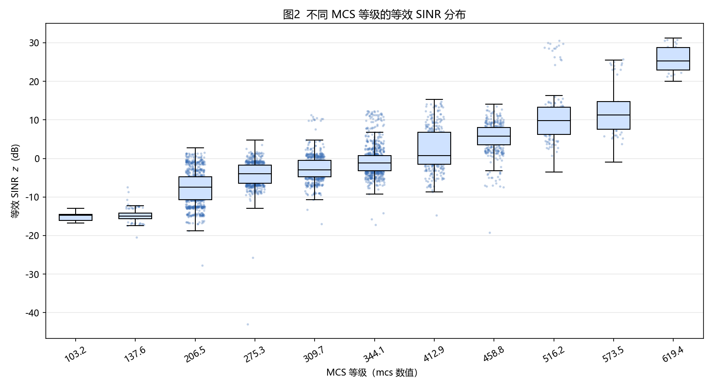
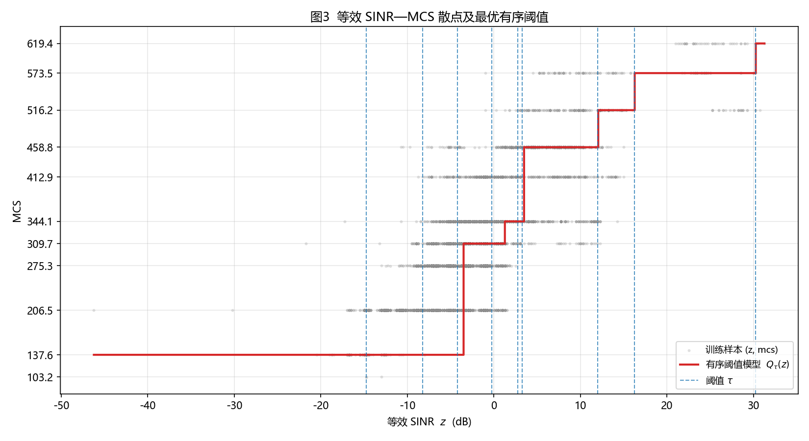
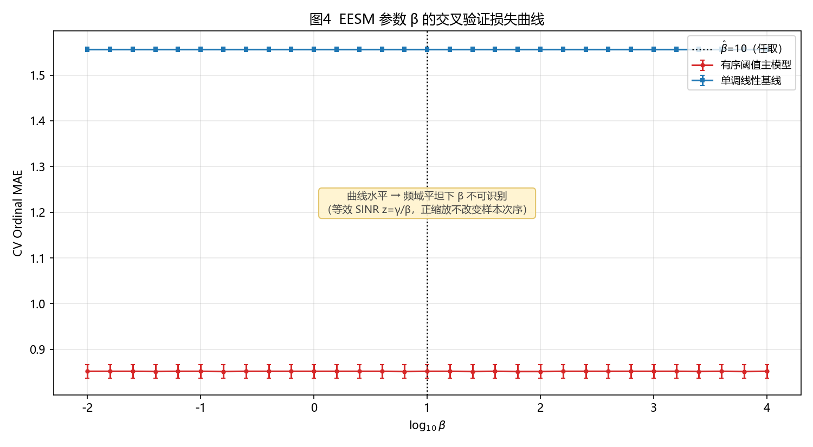
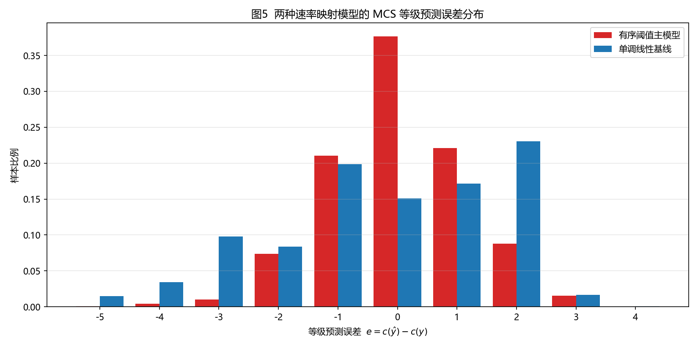
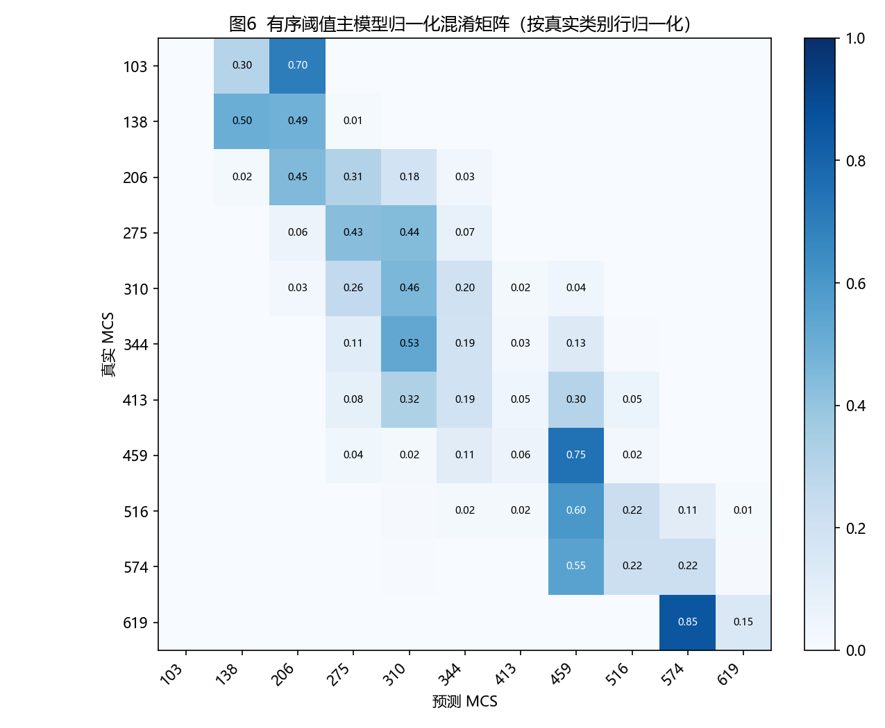

# 问题1 图表汇总（关闭 TxBF · EESM + 有序阈值模型）

> 由 `problem1/make_figures.py` 自动生成。图片位于 `problem1/output/figures/`，
> 完整表格 CSV 位于 `problem1/output/tables/`。所有数值来自 5-fold 分层交叉验证（seed=42）。

> **关键前提**：数据频域平坦（每样本 122 载波 SINR 恒定到机器精度），等效 SINR 退化为 $z=\gamma/\beta$，故 **EESM 参数 β 不可识别**——图4 曲线水平、表1 的 β 为任取值，这是数据的固有性质而非拟合失败。

---

## 一、图

### 图2  不同 MCS 等级的等效 SINR 分布

**简介**：按真实 MCS 分组的等效 SINR（dB）箱线图，叠加抖动散点。各等级中心位置总体右移、相邻等级部分重叠，说明等效 SINR 对 MCS 有显著且有序的区分能力，但非一一对应，需数据驱动标定阈值。

### 图3  等效 SINR—MCS 散点及最优有序阈值

**简介**：训练样本 $(z,\text{mcs})$ 散点、最优阈值 $\tau$（蓝色虚线）与主模型阶梯函数 $Q_\tau(z)$（红色）。阈值间距明显不均，直观解释了为何简单线性模型不足以刻画 $z\to\text{MCS}$ 关系。

### 图4  EESM 参数 β 的交叉验证损失曲线

**简介**：主模型与线性基线的 CV Ordinal MAE 随 $\log_{10}\beta$ 变化（含各折标准差误差棒）。两条曲线均水平 → β 不可识别；主模型曲线整体低于基线，佐证其更优。

### 图5  两种模型的 MCS 等级预测误差分布（折外预测）

**简介**：等级误差 $e=c(\hat y)-c(y)$ 的样本比例。主模型误差高度集中在 $e=0,\pm1$，线性基线在 $e=0$ 处比例明显更低、大幅误判更多。

### 图6  有序阈值主模型归一化混淆矩阵（折外预测）

**简介**：按真实类别行归一化。质量集中于主对角线及相邻位置，说明误判主要是相邻速率等级间的局部错误，与 Ordinal MAE、Acc±1 的评价一致。

---

## 二、表

### 表1  问题1 两类模型参数标定结果

**简介**：外层 β 与第三层参数的最优标定值。因频域平坦，β 不可识别（任取）；线性基线给出解析斜率/截距 $a,b$，主模型阈值见 表2。

| 模型 | 最优EESM参数 β̂ | 第三层参数 |
| --- | --- | --- |
| 单调线性基线 | 10（不可识别,任取） | a=7.486186e-03, b=4.171526 |
| 有序阈值主模型 | 10（不可识别,任取） | τ 见表2 |

### 表2  有序阈值模型最优阈值表

**简介**：主模型各相邻 MCS 等级间的等效 SINR 分界点 $\tau_\ell$（线性尺度与 dB 对照）。模型内部实际使用**线性尺度**阈值，dB 列仅供展示。

| 阈值 | 相邻MCS等级 m_ℓ/m_ℓ+1 | 线性尺度 τ | dB (10log10τ) |
| --- | --- | --- | --- |
| τ_1 | 137.6 / 206.5 | 3.365581e-02 | -14.7294 |
| τ_2 | 206.5 / 275.3 | 1.503350e-01 | -8.2294 |
| τ_3 | 275.3 / 309.7 | 3.776244e-01 | -4.2294 |
| τ_4 | 309.7 / 344.1 | 9.485495e-01 | -0.2294 |
| τ_5 | 344.1 / 412.9 | 1.892605e+00 | 2.7706 |
| τ_6 | 412.9 / 458.8 | 2.123538e+00 | 3.2706 |
| τ_7 | 458.8 / 516.2 | 1.592429e+01 | 12.0206 |
| τ_8 | 516.2 / 573.5 | 4.237015e+01 | 16.2706 |
| τ_9 | 573.5 / 619.4 | 1.064290e+03 | 30.2706 |

### 表3  主模型与基线性能比较（5-fold CV，mean±std）

**简介**：以 Accuracy、Ordinal MAE、Acc±1 三项序数指标比较。有序阈值主模型 Accuracy 最高、Ordinal MAE 最低，显著优于单调线性基线；L2 等渗为额外内部对照。

| 模型 | Accuracy↑ | Ordinal MAE↓ | Acc±1↑ |
| --- | --- | --- | --- |
| 单调线性基线 | 0.1512±0.0009 | 1.5564±0.0046 | 0.5214±0.0007 |
| 有序阈值主模型 | 0.3763±0.0083 | 0.8520±0.0148 | 0.8077±0.0073 |
| L2等渗(额外对照) | 0.3636±0.0089 | 0.8519±0.0135 | 0.8159±0.0054 |

### 表4  验证集 B（关闭 TxBF）最终 MCS 预测结果（共 20369 条，下为前 10 条预览）

**简介**：题目要求的最终预测答案。完整结果见 `problem1/output/tables/table4_valid_predictions.csv`。注：原始数据无 `sta_mac` 列，STA 标识取自终端目录名；`SINR_eff` 为 β* 下的等效 SINR。

| 样本编号 | sta(终端) | 行号 | csi_time | SINR_eff(线性) | SINR_eff(dB) | 预测MCS |
| --- | --- | --- | --- | --- | --- | --- |
| 0 | 341c-f0d4-70be | 0 | 7000012.47299999 | 7.9810e-01 | -0.979 | 309.7 |
| 1 | 341c-f0d4-70be | 1 | 7000122.47299999 | 1.2649e-01 | -8.979 | 206.5 |
| 2 | 341c-f0d4-70be | 2 | 7000205.47299999 | 1.8926e-01 | -7.229 | 275.3 |
| 3 | 341c-f0d4-70be | 3 | 7000307.47299999 | 2.1235e-01 | -6.729 | 275.3 |
| 4 | 341c-f0d4-70be | 4 | 7000406.47299999 | 3.5650e-01 | -4.479 | 275.3 |
| 5 | 341c-f0d4-70be | 5 | 7000515.47299999 | 3.1773e-01 | -4.979 | 275.3 |
| 6 | 341c-f0d4-70be | 6 | 7000623.47299999 | 1.3399e-01 | -8.729 | 206.5 |
| 7 | 341c-f0d4-70be | 7 | 7000726.47299999 | 3.1773e-01 | -4.979 | 275.3 |
| 8 | 341c-f0d4-70be | 8 | 7000739.47299999 | 2.2494e-01 | -6.479 | 275.3 |
| 9 | 341c-f0d4-70be | 9 | 7000932.47299999 | 1.8926e-01 | -7.229 | 275.3 |

---

## 三、结论摘要

- 主模型（EESM + 有序阈值）：Accuracy = **0.3763**，Ordinal MAE = **0.8520**，Acc±1 = **0.8077**。

- 单调线性基线：Accuracy = 0.1512，Ordinal MAE = 1.5564，Acc±1 = 0.5214。主模型全面优于基线。

- 频域平坦导致 β 不可识别；模型对噪声口径（×N_RX、mW/W）不变，已在 `problem1/output/noise_convention_check.txt` 留证。

